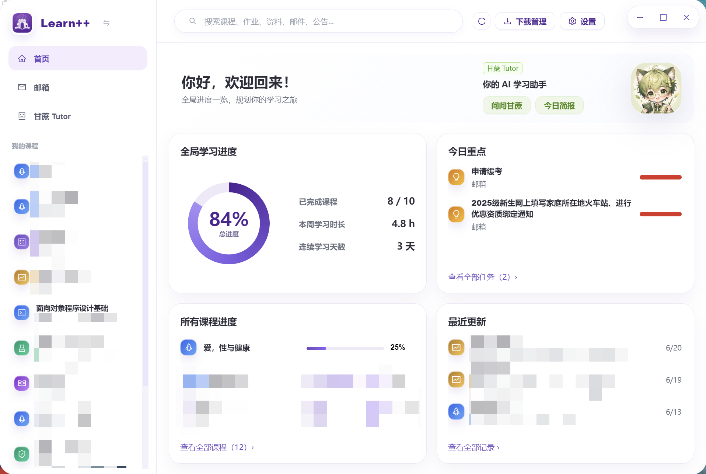
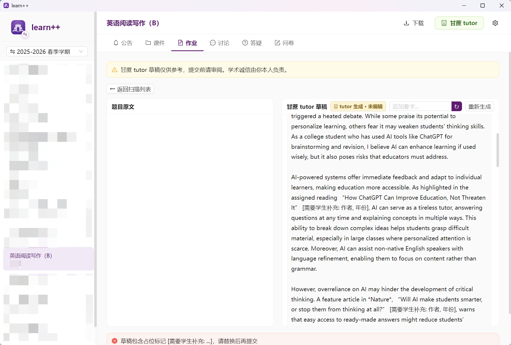

<div align="center">
  

  <h1>learn++</h1>

  <p><strong>面向清华网络学堂的第三方桌面客户端</strong></p>
  <p>把公告、课件、作业、讨论、下载管理、多账号与AI助手放进一个更顺手的学习工作台。</p>

  <p>
    
    
    
    
    
  </p>
</div>

---

## 这是什么

learn++ 是一个面向清华网络学堂的**第三方**桌面客户端，目标是让学生日常使用网络学堂时少一点跳转、多一点秩序。本项目不隶属于清华大学或清华网络学堂官方。

在浏览器里，课程公告、课件、作业、讨论、答疑和问卷常常散落在不同页面里；下载文件、查截止时间、看老师留言、找自己提交过什么，也需要反复点来点去。learn++ 把这些高频操作整理成一个桌面端工作台，并加入首页学习仪表盘、清华邮箱、下载历史、多账号切换、后台常驻和 AI 辅助学习能力。

当前版本：`v2.0.0`（**开发中，尚未正式发布**。已知问题与交接说明见 [HANDOVER.md](HANDOVER.md)）

## 界面预览

### 课程工作台

<p align="center">
  
</p>

### 甘蔗tutor

<p align="center">
  
</p>

## 适合谁

- 希望更集中地查看网络学堂课程信息的学生
- 经常需要批量下载课件和附件的用户
- 想快速查看作业状态、截止时间、提交记录和批阅结果的人
- 有多个账号或测试账号，需要快速切换的人
- 希望用 AI 辅助总结公告、课件、讨论和答疑的人

## 主要功能

### 首页仪表盘（2.0 新增）

- 全局学习进度、已完成课程、本周学习时长、连续学习天数
- 今日重点：按截止时间聚合各课程未提交作业
- 所有课程进度与最近更新时间线
- 全部任务 / 全部课程 / 全部记录的独立页面

### 邮箱（2.0 新增）

- 通过 IMAP/SMTP 连接清华邮箱（`mails.tsinghua.edu.cn`），在窗口内输入账号密码即可，无需外部浏览器
- 配置一次后自动持久化登录，重启应用直接进入收件箱；网络断开后自动重连
- 收件箱、草稿箱、已发送、已删除四个文件夹
- 写信、回复、转发、星标、删除（删除进回收站，发送的邮件写入"已发送"）
- HTML 邮件按原样渲染，保留排版、表格与内嵌图片；附件可另存到本地
- 本地即时过滤 + 服务端全文两级搜索；未读 / 星标筛选与排序
- 甘蔗 Tutor 一键总结邮件、提取待办与时间节点
- 密码使用系统安全能力加密保存

### 课程工作台

- 自动加载当前学期课程，学期可在设置页切换
- 左侧课程列表常驻，课程之间快速跳转
- 公告、课件、作业、讨论、问卷统一入口
- 无边框自绘圆角窗口与自绘窗口控制按钮

### 公告

- 查看课程公告列表
- 支持富文本内容
- 支持公告中的插入图片
- 支持公告附件下载
- 发布时间显示为清晰的本地时间格式

### 课件与下载

- 查看课程课件列表，支持章节筛选、排序与批量下载
- 下载时保留原始文件格式；大文件下载中断会校验完整性并可重试，不产出坏文件
- 自动识别已下载文件
- 下载历史关闭程序后仍保留
- 支持打开文件夹、删除单条记录、清空全部记录
- 甘蔗 Tutor 可总结课件（PDF / Word / PPT）并就课件内容继续追问

### 作业

- 查看作业标题、截止时间、提交状态
- 展示作业要求、老师留言、老师附件
- 支持未截止作业提交与修改
- 支持查看自己的提交内容和提交附件
- 支持查看批阅结果、等级、分数、批阅附件
- 优化异常成绩显示，避免把无效负分当成真实成绩

### 讨论、答疑与问卷

- 查看课程讨论列表
- 讨论详情使用网络学堂原始页面打开，保留头像、回复、点赞等交互
- 提供课程答疑和问卷入口

### 多账号

- 只通过清华网络学堂官方页面登录
- 支持 WebVPN、校园网直连和二级验证
- 登录成功后保存为账号档案
- 点击左上角 logo 可添加账号、切换账号或退出登录
- 账号会话使用系统安全能力加密保存

### 后台运行

- 点击窗口右上角关闭按钮后进入后台
- Windows 托盘图标可重新打开程序
- 托盘右键菜单可退出程序
- 支持开机自启动，并默认在后台运行

### 甘蔗 tutor

甘蔗 tutor 是 learn++ 内置的全栈式 AI 辅助学习助手，深度融入各个功能模块。**仍在持续打磨中，欢迎反馈问题。**

它可以：

- 多轮流式对话，自动感知你当前所在的课程 / 作业上下文（进入时问"这门课/这道题"即可，无需重复说明）
- 调用内置工具直接查询课程、作业（含**得分与批阅情况**）、课件、公告、讨论、邮件、全部截止日期
- 回答中给出可点击的**跳转卡片**，一键直达对应课程页面
- 总结公告、课件、讨论、邮件——结果在侧栏抽屉展示并**持久保存**（重开秒显不重复生成），课件总结还能继续追问
- 首页"**今日简报**"一键汇总近期要交的作业与收件箱新邮件
- 写邮件时"**甘蔗代笔**"，把要点扩写成完整得体的邮件草稿
- 渲染 Markdown 表格与 **LaTeX 数学公式**
- **发送图片提问**（题目截图、手写解答、课件片段——支持选图或直接粘贴，需选用支持视觉的模型）
- 对话历史本地保存，可多会话切换
- 在用户确认学术诚信承诺后，通过"拆题 → 并行生成 → 组装 → 审查"流水线辅助生成作业草稿（附件优先，导出 DOCX/PDF）
- 可选"可爱风 / 正经风"两种对话风格

支持 OpenAI、Anthropic、Google Gemini、DeepSeek、通义千问、智谱 GLM、Moonshot Kimi、豆包/火山方舟、硅基流动、OpenRouter，以及自定义 OpenAI/Anthropic 兼容接口。

API Key 按服务商加密保存，只能写入或替换，不会在界面回显明文。

## 安装

> ⚠️ v2.0.0 仍在开发中，尚未发布正式安装包。以下为发布后的预期产物：

```text
learn++ Setup 2.0.0.exe
```

历史稳定版本可在 GitHub Releases 下载 `learn++ Setup 1.1.1.exe`。

当前版本暂未进行代码签名。如果 Windows SmartScreen 出现提示，可选择“更多信息”后继续运行。正式大规模分发前建议使用代码签名证书。

## 使用流程

1. 启动 learn++。
2. 点击“通过清华网络学堂官方页面登录”。
3. 在弹出的官方登录窗口完成认证。
4. 登录成功后进入课程工作台。
5. 左侧选择课程，顶部切换公告、课件、作业、讨论等模块。
6. 如需使用邮箱，点击左侧"邮箱"，输入清华邮箱账号密码登录（开启两步验证的账号需使用客户端专用密码）。
7. 如需添加账号，点击左上角 learn++ logo。
8. 如需配置甘蔗 tutor，进入右上角设置填写 AI 服务商与 API Key。

## 隐私与安全

learn++ 会在本机保存必要的登录会话、账号档案、下载历史和 AI 服务配置。

- 登录会话和账号档案使用 Electron `safeStorage` 调用系统能力加密保存
- API Key 按服务商加密保存，不会明文回显
- 项目不会主动上传你的账号、Cookie、API Key 或下载文件
- `.gitignore` 已排除本地构建产物、依赖目录和加密文件

在 Windows 上，这些用户数据通常位于：

```text
C:\Users\<你的用户名>\AppData\Roaming\learn++
```

因此，即使使用免安装版或重新安装程序，只要这个用户数据目录还在，登录状态、账号档案和设置仍可能被保留。若需要彻底清除本机数据，可先退出 learn++，再删除该目录。

## 开发

```bash
npm install
npm run dev
```

常用命令：

```bash
npm run typecheck    # TypeScript 类型检查
npm run build        # electron-vite 构建
npm run package:dir  # 生成 win-unpacked 目录版
npm run package      # 生成 NSIS 安装包
```

## 技术栈

- Electron 31
- React 18
- TypeScript 5
- Ant Design 5
- TanStack Query
- Zustand
- thu-learn-lib（网络学堂）
- node-imap / mailparser / nodemailer（邮箱）
- KaTeX（公式渲染）、DOMPurify（HTML 消毒）
- electron-builder / NSIS

## 项目结构

```text
src/
  main/       Electron 主进程、IPC、登录态、下载、作业提交、邮件、AI 服务
  preload/    安全桥接层，暴露 window.learn API
  renderer/   React 前端页面、组件、状态管理
  shared/     主进程和渲染进程共享配置

config/        重要功能和 bug 修复记录
resources/     图标与资源文件
scripts/       构建辅助脚本
```

面向开发者 / AI agent 的完整交接文档（架构、已知问题清单、实施路线图）见 [HANDOVER.md](HANDOVER.md)；维护铁律见 [CLAUDE.md](CLAUDE.md)。

## 免责声明

learn++ 是面向个人学习效率的第三方桌面客户端，不代表清华大学或清华网络学堂官方立场。使用本程序访问网络学堂时，请遵守学校相关规定、课程要求和学术诚信规范。

**本项目主要使用 Claude Code 与 Codex 辅助开发。如项目内容存在侵权或不当之处，请联系维护者处理。**

甘蔗 tutor 生成内容仅供学习参考与测试验证。真实作业、讨论和提交内容应由用户自行审阅、修改并承担责任。

## 许可证

MIT License. 详见 [LICENSE](LICENSE)。

第三方依赖与字体资源说明见 [THIRD_PARTY_NOTICES.md](THIRD_PARTY_NOTICES.md)。
